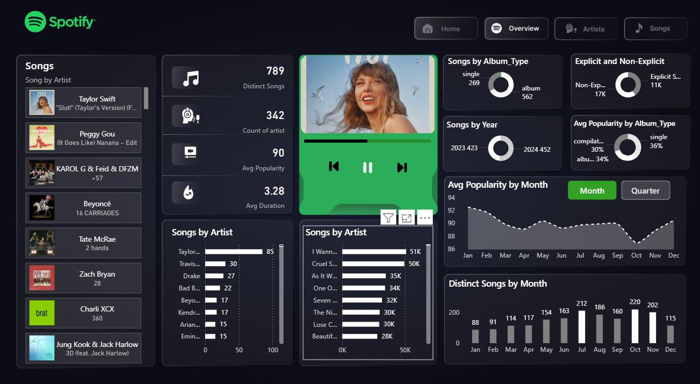

# 1. Project Title:
### 🎧 Spotify Music Insights Dashboard – Power BI
---

## 🖼️ Dashboard Preview

---
# 2. Project Description
 - The **Spotify Dashboard** is an interactive Power BI project that provides deep insights into Spotify’s music trends, artist performance, and listener preferences.  
 
  - It visualizes key metrics such as **song popularity**, **album types**, **explicit content distribution**, and **monthly trends** — giving a complete overview of what’s trending on Spotify.

---

# 3. Tools & Technologies
- **Power BI Desktop** – Data Visualization & Dashboard Design  
- **Data Source:** Spotify dataset (public / Kaggle / API)  
- **Techniques Used:**
  - DAX Measures  
  - Slicers & Interactive Filters  
  - Custom KPIs & Cards  
  - Data Modeling and Relationship Setup  
---
# 4. Project Goals
- Identify top artists, songs, and albums on Spotify.  
- Analyze trends by year and month.  
- Compare album types and explicit content.  
- Visualize key insights through an interactive Power BI dashboard.

---

## 5. Key Features
- 🎵 **Top Artists & Songs**  
  - Taylor Swift leads with **85 tracks**, followed by Travis Scott, Drake, and Beyoncé.  
  - “I Wanna Be Yours” and “Cruel Summer” are among the most streamed songs.

- 📅 **Yearly Trends**  
  - The dataset includes tracks from **2023** and **2024**, showing steady growth in new releases.

- 💽 **Album Type Analysis**  
  - Majority are **album tracks (562)**, while **singles (269)** also make up a significant share.

- ⚖️ **Explicit vs Non-Explicit Content**  
  - Around **17K Non-Explicit** and **11K Explicit** songs — highlighting diverse listener preferences.

- 📊 **Popularity Metrics**  
  - Average song popularity is **90**, with monthly variations visualized in an interactive trend chart.

- 📈 **Song Count by Month**  
  - Peaks observed in **June (212)** and **November (202)** — possibly aligned with major releases.

- 🕒 **Average Song Duration**  
  - Average duration: **3.28 minutes**, aligning with standard streaming-friendly track lengths.

---

# 6. Insights
- Taylor Swift dominates the Spotify charts both in **number of songs** and **popularity**.  
- **Albums** contribute more to Spotify’s song library than singles.  
- Listener engagement dips mid-year but rises again towards **Q4**.  
- Popularity is relatively stable across the year, suggesting consistent user interaction.  
- Explicit songs form about **40%** of the total, showing the platform’s broad content range.

---

## 🖼️ Dashboard Preview

---

# 🏁 Conclusion
This Spotify Power BI Dashboard provides valuable insights into music trends, artist performance, and listener behavior.  
It helps transform raw Spotify data into actionable insights, supporting better decision-making for marketing, content planning, and audience engagement.

---
## 📂 Project Structure
